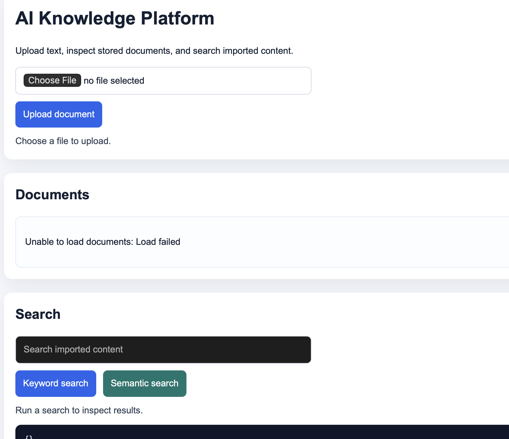

# AI Knowledge Platform

A local-first document ingestion and retrieval API built with FastAPI, PostgreSQL, pgvector, and Docker Compose.

## Current Features

- Upload text documents
- Store document metadata and content in PostgreSQL
- Split documents into searchable chunks
- Search chunks using PostgreSQL full-text search
- Ask questions and retrieve relevant context
- Run the API and database with Docker Compose
- Apply database schema using a versioned SQL migration
- Use a Makefile for repeatable local development commands
- Generate local embeddings for document chunks
- Store embeddings in pgvector
- Search chunks using semantic vector similarity

## Tech Stack

- Python 3.14
- FastAPI
- PostgreSQL 17
- pgvector
- Docker
- Colima
- Docker Compose
- Makefile

## Screenshot

## Architecture

Client / Swagger UI
        |
        v
FastAPI API Container
        |
        v
PostgreSQL + pgvector Container

## Frontend

A Vite-based browser interface is available under [frontend](frontend) for uploading documents, viewing stored documents, and running keyword/semantic search against the API.

### Run locally

1. Start the backend and database with `make up`
2. In the frontend folder, run `npm install` once
3. Start the UI with `npm run dev`
4. Open the local Vite URL shown in the terminal and upload a text file to confirm it appears in the document list

## Development Notes

- Backend tests: `cd backend && pytest -q`
- Docker services: `make up` / `make down`
- Database migrations: `make migrate`